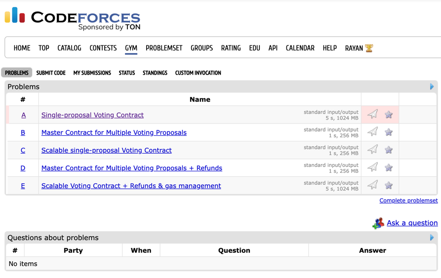
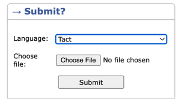
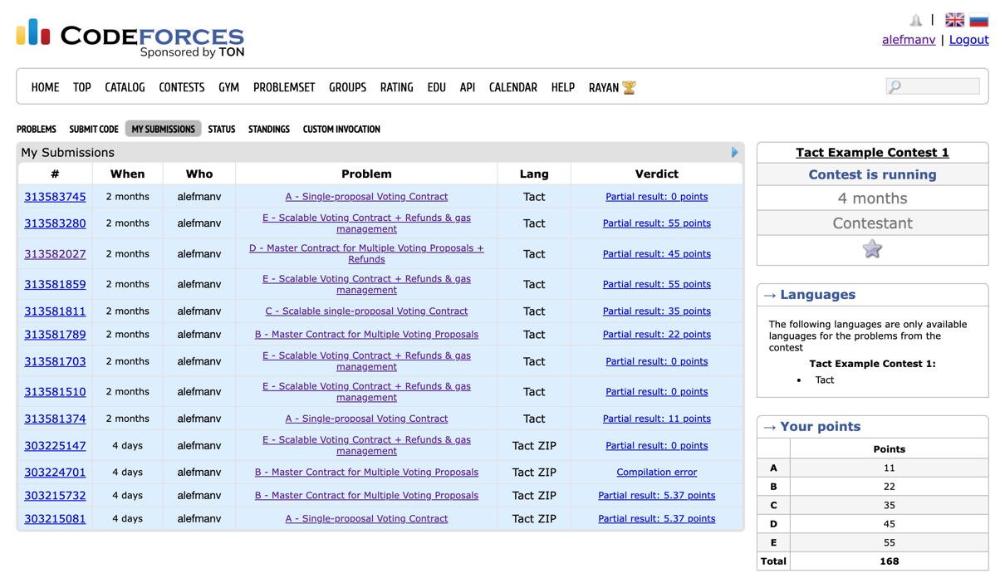
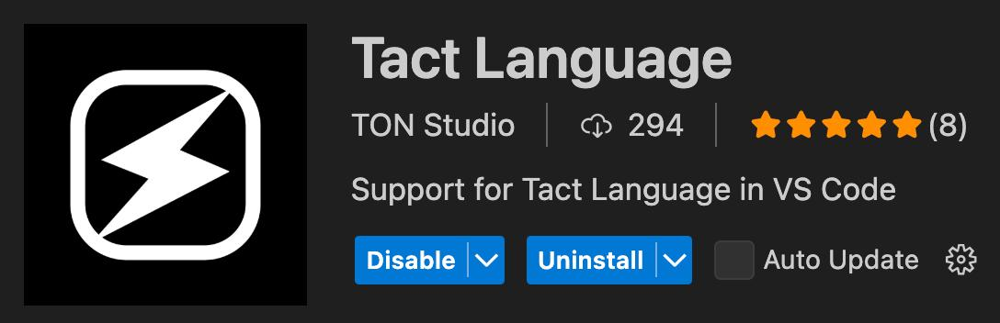

# 🧠 Tact Smart Battle 🤜🤛

### Organized by [TON Studio](https://tonstudio.io/) & [Codeforces](https://codeforces.com/)

Welcome to the ultimate smart contract challenge built on [Tact](https://docs.tact-lang.org/) — the language for scalable smart contracts on TON. Compete with other developers, write efficient on-chain code, and win Toncoin and exclusive SBTs.

---


## 🗂️ Challenge Structure

The challenge consists of 5 tasks with increasing complexity. Each one focuses on specific smart contract design and optimization patterns.

| Task Level | Title                         | Description                                                 |
|------------|-------------------------------|-------------------------------------------------------------|
| 1          | Simple Voting                 | A basic single-contract voting system.                      |
| 2          | Serial Voting                 | Deploy multiple proposals through a master contract.        |
| 3          | Scalable Voting               | Handle up to 4 billion voters within strict storage limits. |
| 4          | Voting with Refunds           | Add TON refund logic for voters and master contract top-ups.|
| 5          | Gas-Managed Voting            | Combine scalability, refunds, and gas management.           |


## 🧪 How to Participate

### 🛠 Prerequisites

- [Node.js + npm](https://nodejs.org/)
- [GitHub CLI](https://git-scm.com/downloads)

### 🚀 Quick Start
1. **Create or log in to your Codeforces account**
    - Go to [codeforces.com](https://codeforces.com/)
    - If you don’t have an account yet, click “Register” and follow the instructions.


2. **Register for the Tact Smart Battle challenge**
    - After logging in, visit the official challenge page on Codeforces (link will be provided). // TODO
    - Complete the registration form.
    - Be sure to enter your:
        - **Telegram username** — for community contact and support
        - **TON wallet address** — to receive Toncoin prizes and SBTs


3. **Clone the official challenge repository**

    - This repo contains all templates, tests, and structure:
   ```bash
   git clone https://github.com/ton-studio/tact-smart-battle.git
   cd tact-smart-battle
   ```
4. Install dependencies:
    ```bash
   npm install
   ```
5. **Solve tasks locally**
    - Each task has a separate .tact file
    - You can run public tests using:
       ```bash
      npm run test public1       # test for Task 1
       npm run test public2       # test for Task 2
       npm run test               # run all public tests
      ```
6. **Submit your solution on Codeforces**

    - Go to the Codeforces challenge page for the task you’ve completed.
-
    - 


- Upload your `.tact` file that matches the task:
    - `solution1.tact` — for Task 1
    - `solution2.tact` — for Task 2
    - and so on
- Submit the file using the provided web form on Codeforces.


-
    - 
>     ⚠️ **Do not upload zipped folders or multiple files.** Each submission must contain only one `.tact` file for a single task.

7. **Repeat for other tasks**

    - You can submit other tasks in the same way — one at a time.
    - If you improve your solution, you can **resubmit it**.
    - You are allowed **up to 3 submissions per hour per task**.
    - The system will automatically select your **highest scoring solution** for each task and use it in the final leaderboard.


---

### 📊 How results will be displayed

After you submit a solution, the system will automatically evaluate it and select your best attempt for each task. The final leaderboard will show your highest score per task and your total points.

The leaderboard will look like this, so you can see all of your submissions:


Leaderboard Example

> ✅ Only verified participants with at least one valid solution will appear on the final leaderboard.

---

### ❗ Error Feedback

The system provides feedback for the following types of errors:

- **Compilation errors** — if your `.tact` file does not compile, you'll see the compilation output.
- **Runtime errors** — if your contract crashes during test execution (e.g., throws an exit code), the error and exit code will be shown.
- **Test failures** — if your contract does not pass the required interface or logic checks, the failed test cases will be displayed.

This helps you improve your solution and resubmit until you get the best possible result.


## 📦 Submission Format

- Submit **only the smart contract file** for the specific task:
    - `solution1.tact` — for Task 1
    - `solution2.tact` — for Task 2
    - `solution3.tact` — and so on

- Do **not** upload multiple files or zip archives.
- File names **must exactly match** the required format, or your submission will be rejected.

> ❗ Each submission is for **a single task only**. You cannot submit all tasks at once.

---

## 🧮 Tact Smart Battle – Scoring System

The total score in this challenge is **1000 points**, distributed across 5 tasks of increasing difficulty.

Each task includes:
- **Logic Score** — awarded for passing private tests.
- **Gas Bonus** — awarded for efficient, low-gas implementations (only for full-passing solutions).

---

### 🎯 Scoring Breakdown

| Task | Title                  | Logic Score | Gas Bonus | Total Points |
|------|------------------------|-------------|-----------|--------------|
| 1    | Simple Voting          | 90          | +10       | **100**      |
| 2    | Master Contract        | 150         | +20       | **170**      |
| 3    | Scalable Voting        | 200         | +20       | **220**      |
| 4    | Voting + Refunds       | 220         | +30       | **250**      |
| 5    | Gas-Managed Voting     | 230         | +30       | **260**      |
|      |                        |             |           | **1000**     |


### ✅ Logic Score

Each task contains a set of **private tests**. Your logic score depends on how many of them you pass.

For example:  
If Task 3 has 10 private tests → each test is worth `20 points`.

The logic score is calculated proportionally:

---

## 🏆 Prize Pool

Total Prize Pool: **$20,000 in Toncoin**

Top 128 participants will receive Toncoin prizes and SBTs (Soulbound Tokens).

### Prize Breakdown:

- 🥇 **Top 16** — $10,000 total
- 🥈 **Ranks 17–64** — $7,000 total
- 🥉 **Ranks 65–128** — $3,000 total

### 🎖 Soulbound Tokens (SBTs)

- Everyone who scores ≥1 point and provides a valid, verifiable submission will receive a **Participant SBT**.
- Top 16 participants will also receive a **Winner SBT**.

> ⚠️ Public sharing of solutions before the deadline will disqualify your SBT eligibility.

---

## 📝 Submission Rules

- Participants solve tasks **locally** in this repository.
- Each solution is submitted **individually via Codeforces**: [codeforces.com](https://codeforces.com/register).
- Final deadline: **April 15, 23:59 (UTC+3)**. //TODO Date
- Do **not** make public your solutions before the deadline.
- If at least one solution passes, you will be included in the final leaderboard.
- You can use all the features of the language

---

## 📅 Timeline

- 📝 Registration: [codeforces.com/register](https://codeforces.com/register) //TODO (link)
- 🚀 Challenge is open now
- 🛑 Final Submission Deadline: **April 15, 23:59 (UTC+3)** //TODO Date

---

## 🚀 Getting Started with Tact

New to Tact? These quickstart guides and tools will get you up to speed fast:

### 📚 Learn the Language
- [⚡ Learn Tact in Y Minutes](https://docs.tact-lang.org/book/learn-tact-in-y-minutes/)
- [🧠 Tact by Example](https://tact-by-example.org/00-hello-world)

### 🛠 Editor Support & Tools

- [💻 Tact VS Code Extension](https://marketplace.visualstudio.com/items?itemName=tonstudio.vscode-tact) 


- [🌐 TON Web IDE (online editor)](https://ide.ton.org/)
- [🔧 Blueprint CLI](https://github.com/ton-org/blueprint)
- [📁 Tact Project Template](https://github.com/tact-lang/tact-template)

---

## 💬 Community & Support

Join the developer chats to ask questions and connect with other participants:

- [Tact Smart Battle chat (for communication)]() //TODO
- [Tact Telegram](https://t.me/tactlang)
- [TON Dev Chat (English)](https://t.me/tondev_eng)
- [TON Dev Chat (Russian)](https://t.me/tondev)
- [TON Dev Chat (Chinese)](https://t.me/tondev_zh)

---

Good luck, and may your contracts be gas-efficient and bug-free ⚡

   
